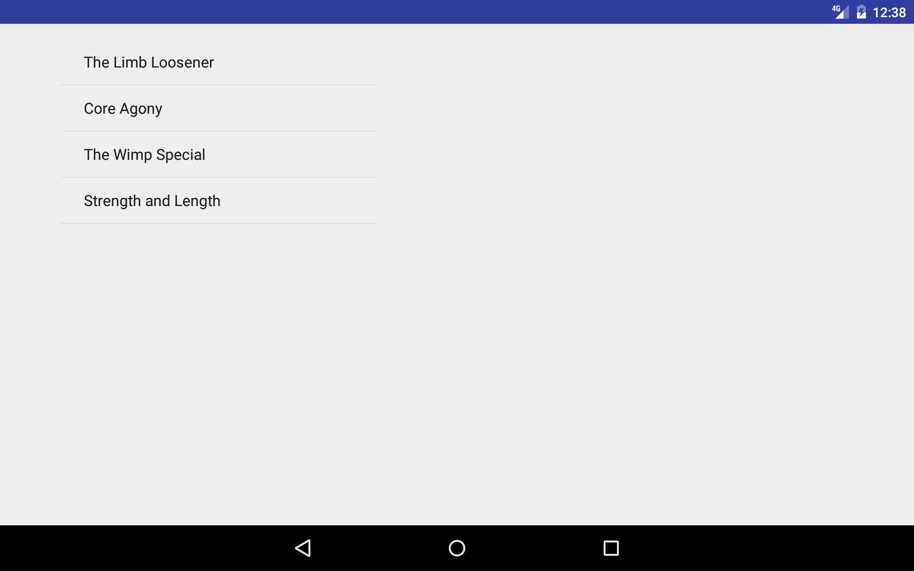
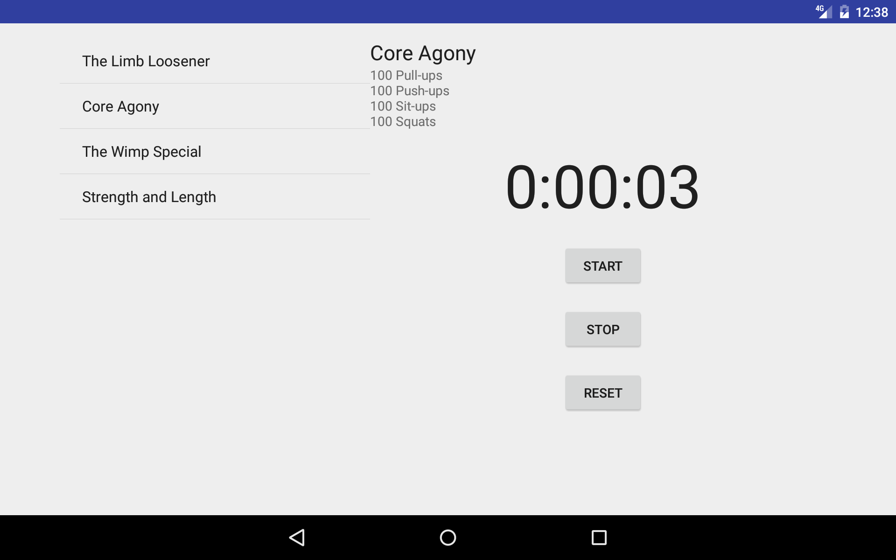

# Chapter 08. Fragments in fragments in...
StopwatchInWorkout. Insert Stopwatch Activity (as Fragment) into WorkoutDetail Fragment.

Modules: Fragments, Fragments in Fragments (API 17+).

## Screenshots:

